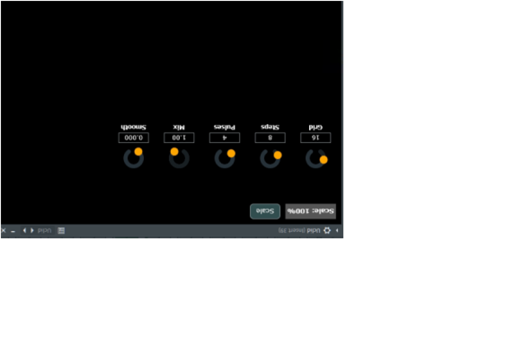
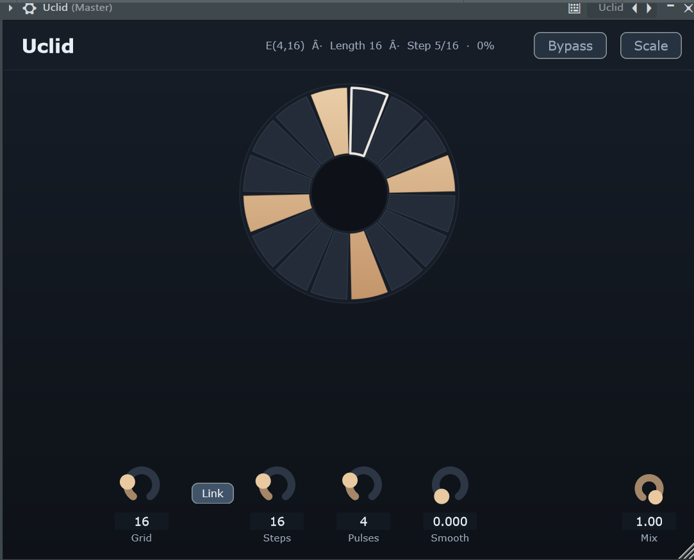
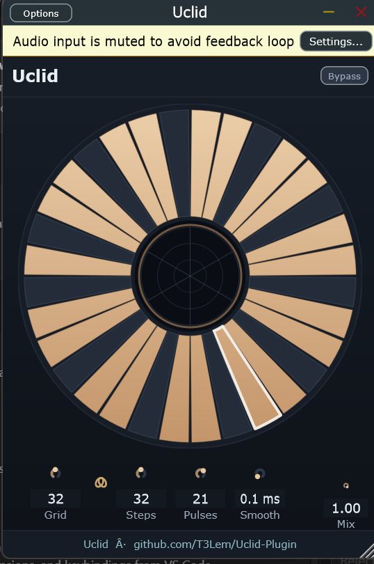
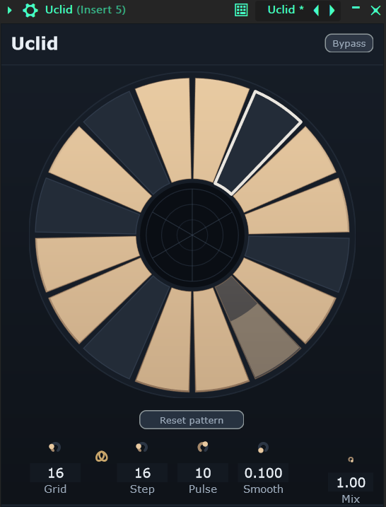

# Uclid

A small **audio plugin** that gates volume with a **[Euclidean rhythm](https://en.wikipedia.org/wiki/Euclidean_rhythm)** — think `E(pulses, steps)` synced to your DAW tempo.

This repo is part of my **open-source plugin learning** work: building real tools in C++ and JUCE, breaking them in FL Studio, and fixing what I learn. Code is public so the process is visible, not just the result.

**Author:** [Tal Shimoni]


---

## The learning curve

Same idea, three checkpoints. The first screenshot is the rough prototype in FL Studio; the later versions show the plugin becoming tighter, cleaner, and more intentional.

| v0 — first try | v1 — usable | v1.1 — cleaner | v1.2 — FL automation |
|----------------|-------------|----------------|----------------------|
|  |  |  |  |

**What v0 taught me**

- Euclidean math *can* drive a musical gate — that part was worth keeping.
- Long smoothing and mismatched parameters fight the groove.
- A plugin in the wrong folder is a plugin that “doesn’t exist” in FL Studio.

**What changed**

- Step timing tied to the transport, not vibes.
- A circular pattern you can read (and drag to set pulses).
- Short ramps only on step edges, plus a sane VST3 install.
- v1.1 tightens the layout, scale, and interaction feel.
- v1.2 exposes Grid, Step, Pulse, and Mix to FL Studio’s native right-click automation (Create automation clip, Link to controller, Last tweaked).

That gap — ugly but working → intentional and usable — is why this repo exists.

---

## What it does today

- Tempo-synced **E(p, k)** gain pattern on your audio  
- **VST3** for FL Studio and other hosts · **Standalone** for quick tests  
- Circular UI, link/split **Grid** and **Steps**, light de-click (**0–10 ms**)  
- **Mix** and bypass like a normal effect  
- **FL Studio integration:** right-click Grid, Step, Pulse, or Mix for host automation and MIDI mapping  

---

## I just want to use it in FL Studio

You do **not** need CMake or Visual Studio for that.

1. Get a built `Uclid.vst3` (from [`final/VST3`](final/VST3) after someone builds it, or build once — see below).
2. Run **`install-uclid-vst3.ps1`** (copies into your FL user plugin folder).
3. In FL: **Options → Manage plugins → rescan**. Use **64-bit** FL.

If you prefer the system VST3 folder, use **`install-to-program-files.ps1`** in **Admin** PowerShell instead.

---

## Do I need all those build commands?

**Only if you are compiling from source** — e.g. you changed `Uclid/Source/` and want a fresh `.vst3`.

Building is a one-time toolchain setup (CMake + Visual Studio + Windows SDK), then two commands. JUCE downloads on first configure. None of that is required just to *load* the plugin in a DAW.

<details>
<summary><strong>Build from source (developers)</strong></summary>

```powershell
cd CRSR
cmake --preset windows-release
cmake --build build --config Release --target Uclid_VST3 Uclid_Standalone
```

Outputs: `final/VST3/Uclid.vst3` · `final/Standalone/Uclid.exe`

Full notes (requirements, both install scripts, folder layout): **[docs/BUILDING.md](docs/BUILDING.md)**

</details>

---

## Project shape

| Area | What’s there |
|------|----------------|
| `Uclid/Source/` | DSP + UI |
| `docs/images/` | README screenshots |
| `final/` | Build output (not in git) |
| `install-*.ps1` | Copy VST3 into FL-friendly locations |

---

## Repo & license

**GitHub:** [github.com/T3Lem/Uclid-Plugin](https://github.com/T3Lem/Uclid-Plugin)

Source is shared publicly for learning and reference. **All rights reserved** — if you want to fork commercially or redistribute builds, get in touch.
